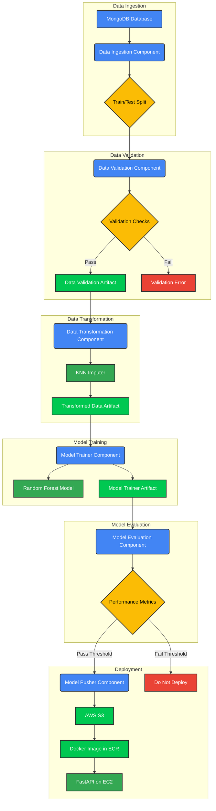
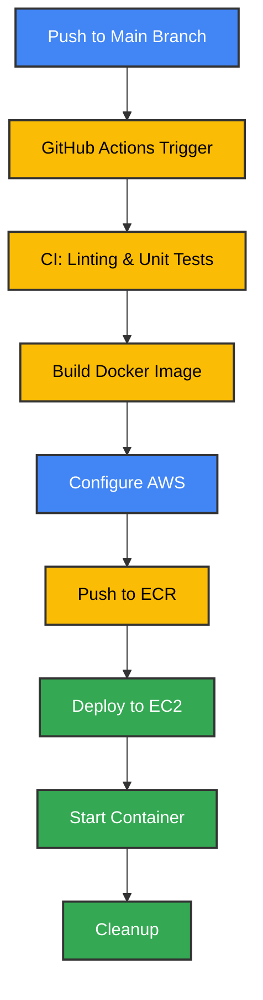

# Network Security using Phishing Data


[](https://github.com/Sumanthcs4/NetworkSecurity/actions/workflows/main.yml)


## Project Overview

This project focuses on analyzing and improving network security using machine learning techniques. It includes a complete pipeline that covers data ingestion from a MongoDB database, data validation, data transformation, model training, evaluation, and deployment using Docker and AWS. The project leverages DAGsHub for MLOps, providing experiment tracking, model versioning, and data versioning.

The machine learning model used in this project is a **Random Forest Classifier**, which has demonstrated high performance in classifying network traffic as benign or malicious based on various network features.

## Project Architecture



## Deployment Pipeline



## Technologies Used

- **Programming Language:** Python 3.10
- **Machine Learning:** scikit-learn (RandomForestClassifier, KNNImputer), pandas, numpy
- **Data Storage:** MongoDB Atlas (for raw data), AWS S3 (for artifacts and model)
- **MLOps:** DAGsHub, MLflow
- **Deployment:** Docker, AWS EC2, GitHub Actions
- **Web Framework:** FastAPI, Uvicorn
- **Data Validation:** Evidently
- **Other Tools:** awscli

## Features

- **Data Ingestion:** Automated data ingestion from MongoDB with train-test split
- **Data Validation:** Comprehensive validation including schema, column, and drift detection
- **Data Transformation:** KNNImputer for missing values and target variable mapping
- **Model Training:** Random Forest Classifier with automated evaluation
- **Experiment Tracking:** MLflow integration via DAGsHub
- **Model Deployment:** Dockerized application on AWS EC2
- **CI/CD:** Automated pipeline using GitHub Actions
- **Artifact Storage:** AWS S3 bucket integration
- **Web API:** FastAPI-based REST API for predictions

## Dataset

The dataset contains various network security features stored in MongoDB. Key features include:
- IP address characteristics
- URL properties
- Domain information
- SSL/HTTPS metrics
- Traffic patterns
- Security indicators

## Setup Instructions

1. **Clone the Repository:**
```bash
git clone https://github.com/Sumanthcs4/NetworkSecurity.git
cd NetworkSecurity
```

2. **Set up Virtual Environment:**
```bash
python3 -m venv venv
source venv/bin/activate  # Linux/macOS
venv\Scripts\activate     # Windows
```

3. **Install Dependencies:**
```bash
pip install -r requirements.txt
```

4. **Configure Environment Variables:**
Create a `.env` file with:
```
MONGO_DB_URL=your_mongodb_url
AWS_ACCESS_KEY_ID=your_aws_key
AWS_SECRET_ACCESS_KEY=your_aws_secret
AWS_REGION=your_region
TRAINING_BUCKET_NAME=your_bucket
ECR_REPOSITORY_NAME=your_repo
AWS_ECR_LOGIN_URI=your_uri
```

5. **Run the Project:**
```bash
# Run Pipeline
python src/pipeline/training_pipeline.py

# Run API
uvicorn app:app --reload --port 8080
```

## Docker Usage

```bash
# Build
docker build -t networksecurity:latest .

# Run
docker run -p 8080:8080 \
  --name networksecurity \
  -e AWS_ACCESS_KEY_ID=$AWS_ACCESS_KEY_ID \
  -e AWS_SECRET_ACCESS_KEY=$AWS_SECRET_ACCESS_KEY \
  -e AWS_REGION=$AWS_REGION \
  -e TRAINING_BUCKET_NAME=$TRAINING_BUCKET_NAME \
  -e MONGO_DB_URL=$MONGO_DB_URL \
  networksecurity:latest
```

## Project Structure

```
NetworkSecurity/
├── .github/                  # GitHub Actions workflows
├── app.py                   # FastAPI application
├── Artifacts/               # Generated artifacts
├── data_schema/             # Schema definition
├── notebook/                # Jupyter notebooks
├── requirements.txt         # Dependencies
├── src/                     # Source code
│   ├── components/          # Pipeline components
│   ├── config/             # Configurations
│   ├── constant/           # Constants
│   ├── entity/             # Entity definitions
│   ├── exception/          # Custom exceptions
│   ├── logging/            # Logging setup
│   ├── pipeline/           # Pipeline definition
│   └── utils/              # Utilities
├── template.index          # HTML template
├── Dockerfile              # Docker configuration
└── setup.py                # Package setup
```

## Contributing

Please read `CONTRIBUTING.md` for details on our code of conduct and the process for submitting pull requests.

## License

This project is licensed under the MIT License - see the `LICENSE` file for details.
