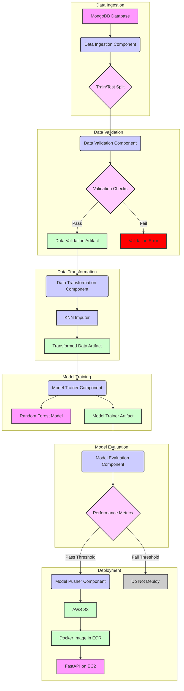
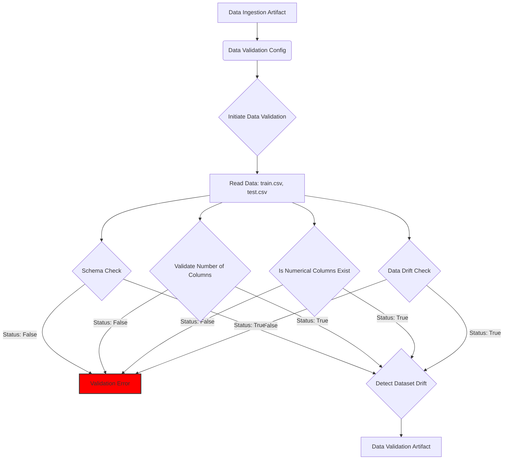
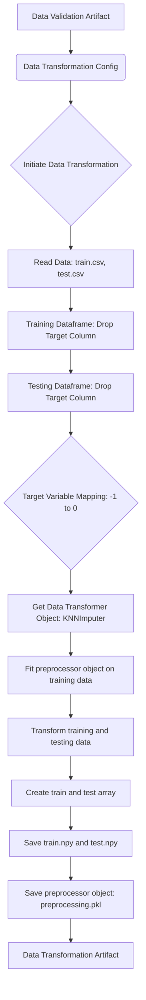
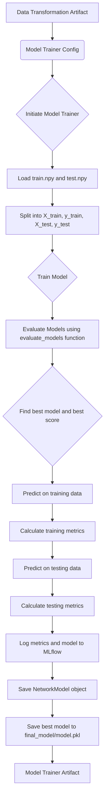

# Network Security Analysis with Machine Learning

[](https://github.com/Sumanthcs4/NetworkSecurity/actions/workflows/workflow.yml)

## Project Overview

This project focuses on analyzing and improving network security using machine learning techniques. It includes a complete pipeline that covers data ingestion from a MongoDB database, data validation, data transformation, model training, evaluation, and deployment using Docker and AWS. The project leverages DAGsHub for MLOps, providing experiment tracking, model versioning, and data versioning.

The machine learning model used in this project is a **Random Forest Classifier**, which has demonstrated high performance in classifying network traffic as benign or malicious based on various network features.

## Project Architecture

The following diagram illustrates the overall architecture of the project:



## Detailed Stage Diagrams:

### Data Validation:


### Data Transformation:


### Model Training:


### Deployment:
```mermaid
graph TD
    A[Push to Main Branch] --> B{GitHub Actions Trigger};
    B --> C[CI: Linting, Unit Tests];
    C --> D{CD: Build & Push Docker Image};
    D --> E[Configure AWS Credentials];
    E --> F[Login to ECR];
    F --> G[Build, Tag, Push Image to ECR];
    G --> H{CD: Deploy to EC2 (Self-Hosted Runner)};
    H --> I[Configure AWS Credentials];
    I --> J[Login to ECR];
    J --> K[Pull Latest Image];
    K --> L[Stop & Remove Existing Container];
    L --> M[Run New Container: map port 8080, set env vars];
    M --> N[Clean Old Images & Containers];
```

## Technologies Used
- **Programming Language:** Python 3.10
- **Machine Learning:** scikit-learn (RandomForestClassifier, KNNImputer), pandas, numpy
- **Data Storage:** MongoDB Atlas (for raw data), AWS S3 (for artifacts and model)
- **MLOps:** DAGsHub, MLflow
- **Deployment:** Docker, AWS EC2, GitHub Actions
- **Web Framework:** FastAPI, Uvicorn
- **Data Validation:** Evidently
- **Other Tools:** awscli

## Features
- **Data Ingestion:** Automated data ingestion from a MongoDB database with train-test split.
- **Data Validation:** Comprehensive data validation checks, including schema validation, column number validation, numerical column existence check, datatype check, and data drift detection using the evidently library.
- **Data Transformation:** Data preprocessing using a KNNImputer to handle missing values and target variable mapping.
- **Model Training:** Training and evaluation of a Random Forest Classifier.
- **Experiment Tracking:** Integration with MLflow (via DAGsHub) to track experiments, log metrics (F1-score, precision, recall), and log the trained model.
- **Model Deployment:** Dockerized application deployed on AWS EC2 using a self-hosted GitHub Actions runner.
- **CI/CD:** Automated CI/CD pipeline using GitHub Actions for linting, testing, building, pushing the Docker image to Amazon ECR, and deploying to EC2.
- **Artifact Storage:** Stores artifacts (datasets, preprocessor, trained model) in an AWS S3 bucket.
- **Web API:** REST API built with FastAPI to serve predictions.

## Dataset
The dataset used in this project is stored in a MongoDB database. The schema of the data is defined in `data_schema/schema.yaml`. The dataset contains the following features (all numeric):

```yaml
columns:
  - having_IPhaving_IP_Address: numeric
  - URLURL_Length: numeric
  - Shortining_Service: numeric
  - having_At_Symbol: numeric
  - double_slash_redirecting: numeric
  - Prefix_Suffix: numeric
  - having_Sub_Domain: numeric
  - SSLfinal_State: numeric
  - Domain_registeration_length: numeric
  - Favicon: numeric
  - port: numeric
  - HTTPS_token: numeric
  - Request_URL: numeric
  - URL_of_Anchor: numeric
  - Links_in_tags: numeric
  - SFH: numeric
  - Submitting_to_email: numeric
  - Abnormal_URL: numeric
  - Redirect: numeric
  - on_mouseover: numeric
  - RightClick: numeric
  - popUpWidnow: numeric
  - Iframe: numeric
  - age_of_domain: numeric
  - DNSRecord: numeric
  - web_traffic: numeric
  - Page_Rank: numeric
  - Google_Index: numeric
  - Links_pointing_to_page: numeric
  - Statistical_report: numeric
  - Result: numeric

target_column: Result
```

## AWS Deployment

The project is deployed on AWS EC2 using a self-hosted GitHub Actions runner. The CI/CD pipeline automates the following steps:

1.  **Continuous Integration:**
    *   Performs linting on the codebase (currently a placeholder in the workflow).
    *   Executes unit tests (currently a placeholder in the workflow).

2.  **Continuous Delivery:**
    *   Builds a Docker image containing the application and its dependencies.
    *   Pushes the newly built Docker image to Amazon Elastic Container Registry (ECR).

3.  **Continuous Deployment:**
    *   Connects to the EC2 instance (where the self-hosted GitHub Actions runner is configured).
    *   Pulls the latest Docker image from the ECR repository.
    *   Stops and removes any previously running Docker container named `networksecurity`.
    *   Starts a new Docker container based on the pulled image, with the following configurations:
        *   Names the container `networksecurity`.
        *   Maps port 8080 on the EC2 instance to port 8080 inside the container, making the FastAPI application accessible.
        *   Sets environment variables within the container to provide the application with necessary configurations like AWS credentials and the MongoDB connection string. These are sourced securely from GitHub Actions secrets.
        *   Utilizes the host's inter-process communication (IPC) namespace (`--ipc="host"`).
    *   Cleans up any old, unused Docker images and containers from the EC2 instance to free up space.

**Deployment Diagram:**

```mermaid
graph TD
    A[Push to Main Branch] --> B{GitHub Actions Trigger};
    B --> C[CI: Linting, Unit Tests];
    C --> D{CD: Build & Push Docker Image};
    D --> E[Configure AWS Credentials];
    E --> F[Login to ECR];
    F --> G[Build, Tag, Push Image to ECR];
    G --> H{CD: Deploy to EC2 (Self-Hosted Runner)};
    H --> I[Configure AWS Credentials];
    I --> J[Login to ECR];
    J --> K[Pull Latest Image];
    K --> L[Stop & Remove Existing Container];
    L --> M[Run New Container: map port 8080, set env vars];
    M --> N[Clean Old Images & Containers];
```

